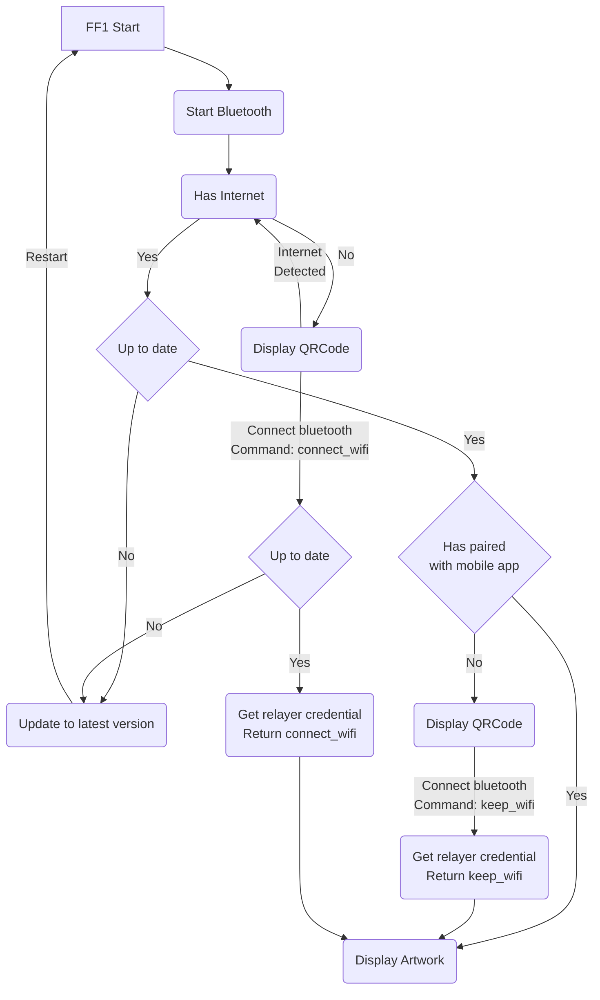
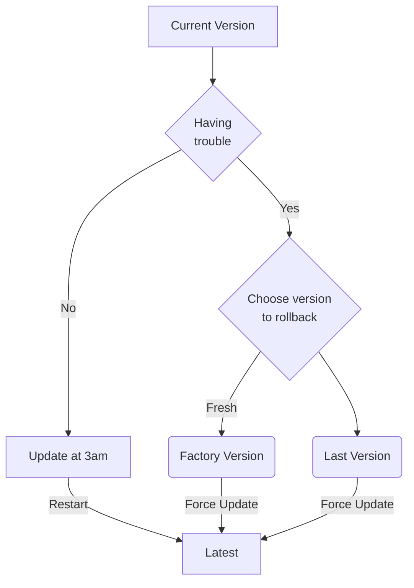

# Setupd

## App startup flow

```mermaid
flowchart TD
    FF1Start[FF1 Start] --> Bluetooth(Start Bluetooth)
    Bluetooth --> HasInternet(Has Internet)

    HasInternet --> |No| QRCode1(Display QRCode)
    HasInternet --> |Yes| UpToDate1{Up to date}

    UpToDate1 --> |No| Update(Update to latest version)
    UpToDate1 --> |Yes| Paired{Has paired<br/>with mobile app}
    Update --> |Restart| FF1Start
    Paired --> |No| QRCode2(Display QRCode)
    Paired --> |Yes| Artwork(Display Artwork)
    QRCode2 --> |Connect bluetooth<br/>Command: keep_wifi| Relayer1(Get relayer credential<br/>Return keep_wifi)
    Relayer1 --> Artwork

    QRCode1 --> |Internet<br/>Detected| HasInternet
    QRCode1 --> |Connect bluetooth<br/>Command: connect_wifi| UpToDate2{Up to date}
    UpToDate2 --> |No| Update
    UpToDate2 --> |Yes| Relayer2(Get relayer credential<br/>Return connect_wifi)
    Relayer2 --> Artwork
```

## App update flow

```mermaid
flowchart TD
    Current[Current Version] --> Trouble{Having<br/>trouble}

    Trouble --> |Yes| Rollback{Choose version<br/>to rollback}
    Trouble --> |No| Update[Update at 3am]

    Update --> |Restart| Latest

    Rollback --> |Fresh| FactoryVersion(Factory Version)
    Rollback --> LastVersion(Last Version)

    FactoryVersion --> |Force Update| Latest
    LastVersion --> |Force Update| Latest
```