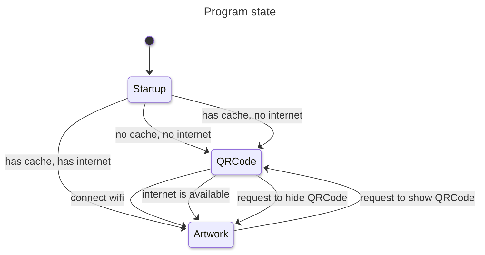
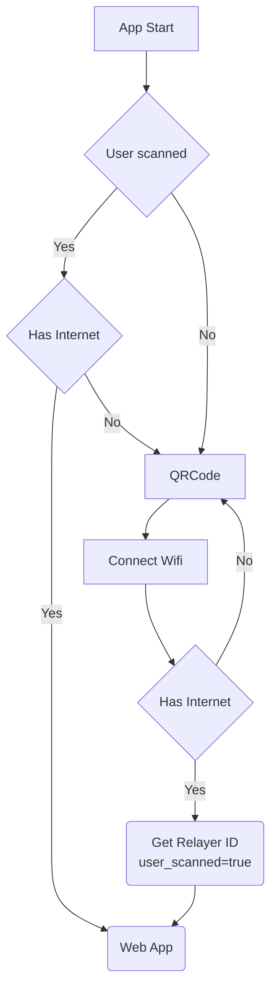

# Flow

```mermaid
---
config:
  theme: mc
  layout: dagre
  look: neo
title: Program state
---
stateDiagram
  direction TB
  [*] --> Startup
  Startup --> QRCode:no cache, no internet
  Startup --> QRCode:has cache, no internet
  Startup --> Artwork:has cache, has internet
  QRCode --> Artwork:connect wifi
  QRCode --> Artwork:internet is available
  QRCode --> Artwork:request to hide QRCode
  Artwork --> QRCode:request to show QRCode

```

```mermaid
flowchart
  AppStart[App Start] --> UserScanned{User scanned}

  UserScanned --> |Yes| HasInternet{Has Internet}
  UserScanned --> |No| QRCode

  HasInternet --> |Yes| WebApp(Web App)
  HasInternet --> |No| QRCode

  QRCode --> ConnectWifi[Connect Wifi]
  ConnectWifi --> HasInternet2{Has Internet}
  HasInternet2 --> |No| QRCode
  HasInternet2 --> |Yes| RelayerID(Get Relayer ID<br/>user_scanned=true)
  RelayerID --> WebApp
```
