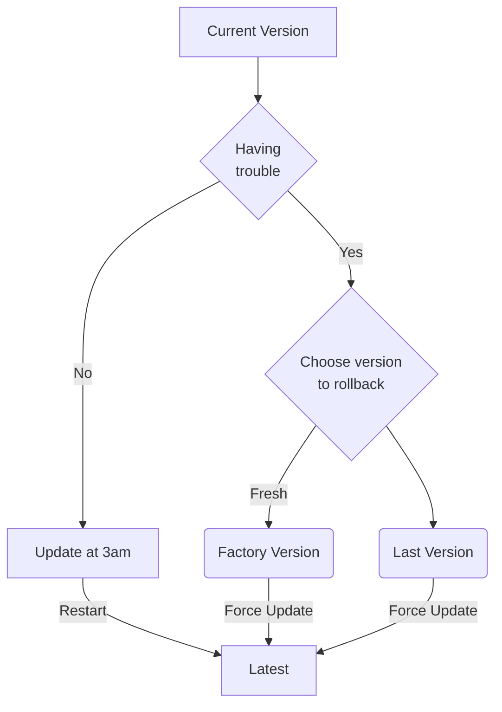

# FFX1

## Device life cycle

### App startup flow

### App update flow

## Telemetry

### Start up flow
| Event Name | Sample JSON | Notes |
| :-------------------------- | :--------------------------------------------------------------------------------------------------------------------------------------------------------------------------------------- | :------------------------------------------------------------------------------------------------------------------------------------------------------------------------------------------------------------------------------------------------------------------------------------------------ |
| `ff1_start` | `{ "event": "ff1_start", "level": "info", "ts": 1234567890 }` | Device started or restarted. |
| `current_version` | `{ "event": "current_version", "level": "info", "ts": 1234567890, "version": "1.1.0" }` | Current version of the device. |
| `bluetooth_started` | `{ "event": "bluetooth_started", "level": "info", "ts": 1234567890 }` | Bluetooth service initiated. |
| `bluetooth_start_failed` | `{ "event": "bluetooth_start_failed", "level": "crit", "ts": 1234567890, "error": "bluetooth_adapter_not_found" }` | Bluetooth failed to start (e.g., adapter not found, permissions issue). |
| `internet_check_initiated` | `{ "event": "internet_check_initiated", "level": "info", "ts": 1234567890 }` | Internet connectivity check started. |
| `internet_check_failed` | `{ "event": "internet_check_failed", "level": "crit", "ts": 1234567890, "error": "failed_to_call_nmcli" }` | Internet connectivity check failed. |
| `internet_connected` | `{ "event": "internet_connected", "level": "info", "ts": 1234567890 }` | Device detected an active internet connection. |
| `internet_disconnected` | `{ "event": "internet_disconnected", "level": "warn", "ts": 1234567890 }` | Device failed to detect an active internet connection. |
| `qr_code_displayed` | `{ "event": "qr_code_displayed", "level": "info", "ts": 1234567890, "reason": "no_internet" }` | QR code displayed for initial setup or network configuration. The `reason` field indicates why it's displayed (e.g., `no_internet`, `not_paired`). |
| `version_check_initiated` | `{ "event": "version_check_initiated", "level": "info", "ts": 1234567890 }` | Started checking for a new firmware version. |
| `version_check_failed` | `{ "event": "version_check_initiated", "level": "info", "ts": 1234567890 }` | Failed checking for a new firmware version. |
| `device_up_to_date` | `{ "event": "device_up_to_date", "level": "info", "ts": 1234567890 }` | Device is running the latest firmware version. |
| `update_available` | `{ "event": "update_available", "level": "info", "ts": 1234567890, "new_version": "1.2.3" }` | A new firmware version is available. |
| `device_paired` | `{ "event": "device_paired", "level": "info", "ts": 1234567890 }` | Device successfully paired with the mobile app. |
| `device_not_paired` | `{ "event": "device_not_paired", "level": "info", "ts": 1234567890 }` | Device is not currently paired with the mobile app. |
| `bluetooth_connect_command_received` | `{ "event": "bluetooth_connect_command_received", "level": "info", "ts": 1234567890, "command": "keep_wifi" }` | A command was received via Bluetooth to connect/manage Wi-Fi. The `command` field specifies the action (e.g., `keep_wifi`, `connect_wifi`). |
| `relayer_credential_retrieved` | `{ "event": "relayer_credential_retrieved", "level": "info", "ts": 1234567890 }` | Relayer credentials successfully obtained. |
| `relayer_credential_failed` | `{ "event": "relayer_credential_failed", "level": "crit", "ts": 1234567890, "error": "network_timeout" }` | Failed to retrieve relayer credentials. |
| `artwork_playback_started` | `{ "event": "artwork_playback_started", "level": "info", "ts": 1234567890 }` | Artwork playback has begun. |

### Update flow
| Event Name | Sample JSON | Notes |
| :-------------------------- | :--------------------------------------------------------------------------------------------------------------------------------------------------------------------------------------- | :------------------------------------------------------------------------------------------------------------------------------------------------------------------------------------------------------------------------------------------------------------------------------------------------ |
| `update_initiated` | `{ "event": "update_initiated", "level": "info", "ts": 1234567890, "reason": "schedule" }` | Firmware update initiated (e.g., `schedule` for 3 AM update, `force` for immediate). |
| `update_failed` | `{ "event": "update_failed", "level": "crit", "ts": 1234567890, "error": "insufficient_space" }` | Firmware update failed during scheduled or forced update. |
| `rollback_to_factory_version` | `{ "event": "rollback_to_factory_version", "level": "info", "ts": 1234567890 }` | Device initiated rollback to factory version. |
| `rollback_to_last_version` | `{ "event": "rollback_to_last_version", "level": "info", "ts": 1234567890, "version": "1.0.0" }` | Device initiated rollback to the last stable version. |
| `force_update_initiated` | `{ "event": "force_update_initiated", "level": "info", "ts": 1234567890 }` | A forced update was initiated after a rollback. |

## Version control

We deploy the firmware versions through 2 main channels:
- Dev channel: https://feralfile-device-distribution.bitmark-development.workers.dev/
- Prod channel: https://x1.feral-file.workers.dev/

Our versioning follow Semantic Versioning format.

Each channel has API to specific min_version and latest_version. If the current version on the device is older than min_version, it's forced to update. Otherwise, it will update to the latest version silently at 3am.